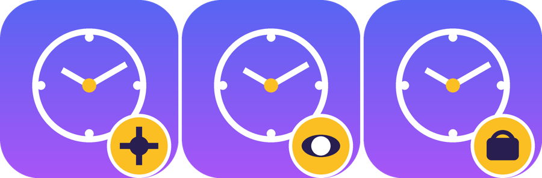

# UsageTimeController

Self-hosted parental controls for macOS — a Family Link alternative. Remotely manage screen time, downtime, and scheduled activities on your child's Mac from a web dashboard or native iOS/macOS app.



## Features

- **Downtime** — block the computer on a schedule (e.g. 10 PM – 8 AM), with separate weekday/weekend windows
- **Screen Time** — daily minute limits, with per-day overrides (Mon/Tue/Wed/…/Sun)
- **Scheduled Activities** — whitelist time windows for classes (e.g. "English Tue 16:00–16:45, ±5 min buffer"): time is not counted, downtime is bypassed, lock is hidden
- **Offline Unlock Codes** — TOTP-style 6-digit code (5-min window) that works without internet. Parent reads the code, child types it, Mac unlocks for 30 minutes
- **Smart Tracking** — only counts real usage (not lock screen, not idle, not sleep)
- **Native apps** — SwiftUI app for iOS 17+ / macOS 14+, plus React web dashboard
- **Root-protected agent** — agent self-installs as a LaunchDaemon so the child can't disable it

## Architecture

```
┌───────────────────┐
│  Parent App       │     ┌──────────────┐      ┌─────────────────┐
│  (SwiftUI,        │────▶│   API Server │◀─────│  macOS Agent    │
│  iOS + macOS)     │     │  (FastAPI)   │      │  (Swift, root)  │
├───────────────────┤     └──────────────┘      └─────────────────┘
│  Web Dashboard    │────▶       ▲
│  (React, browser) │            │
└───────────────────┘            │
                         SQLite + DB volume
```

## Quick Start

### 1. Server (API + Web Dashboard)

```bash
# On your VPS/server with Docker installed
git clone https://github.com/<you>/UsageTimeController.git
cd UsageTimeController

export SECRET_KEY=$(openssl rand -hex 32)
docker compose up -d --build
```

- Dashboard: `http://<server>:3080`
- API:       `http://<server>:8000`
- Swagger:   `http://<server>:8000/docs`

### 2. Set up a parent account

1. Open the dashboard, click **Sign Up**
2. **+ Add Device** → enter Mac name + child's name
3. Copy the one-line **setup string** shown (format: `http://server:8000|TOKEN`)

### 3. Install the agent on the child's Mac

Build from source (one-time):

```bash
open macos-agent/UsageTimeAgent.xcodeproj
# Product → Scheme → Release → Cmd+B
```

Or use the pre-built binary from `dist/UsageTimeAgent.app`. Double-click it:

1. Paste the **setup string** into the dialog → Connect
2. The agent asks to install as a **protected system service** → enter admin password once
3. App is copied to `/Applications/`, a root LaunchDaemon is installed as watchdog
4. From now on the agent auto-starts on boot, restarts if killed, can't be removed without admin password

### 4. Configure rules

In the dashboard or parent app:
- **Downtime** — computer is locked (default 22:00–08:00). Separate schedules for weekdays/weekends
- **Screen Time** — minutes per day. Optional per-day overrides (Mon/Tue/.../Sun)
- **Scheduled Activities** — whitelist classes/lessons with a buffer

## How the Agent Works

Menu bar app (Swift + AppKit), runs as the console user with a root watchdog.

- **Activity detection** (every 30s): counts a minute only when screen is on, unlocked, and user wasn't idle >5 min (IOKit `HIDIdleTime` + `CGSessionCopyCurrentDictionary`)
- **Sync** (every 20s, 5s while locked): fetches policy from `/agent/config`, reports usage to `/agent/usage`
- **Full-screen lock** when downtime/limit hit: borderless `NSWindow` at `maximumWindow` level, covers all screens including full-screen apps
- **TOTP input** is always visible on lock screen, auto-focuses and auto-submits on 6 digits
- **Native notifications** at 15/10/5/1 min warnings

## Offline Unlock (TOTP)

When the agent is offline or the parent needs to override quickly:
1. Open parent app / dashboard → see the current 6-digit code under "Unlock Code"
2. Tell it to the child (voice, phone, carrier pigeon)
3. Child types it on the lock screen → Mac unlocks for 30 minutes, time is not counted

Algorithm: HMAC-SHA1 with a shared secret, 300-second step (5 min), ±1 step tolerance. Same implementation in Python, Swift, and pure JS (no Web Crypto API).

## Tamper Protection

With the child running as a **Standard User** (not admin):
- `/Applications/UsageTimeAgent.app` is owned by root → can't be deleted
- `/Library/LaunchDaemons/com.usagetime.agent-watchdog.plist` owned by root → can't be unloaded
- Killing the agent → watchdog restarts it within 15s
- Cmd+Q intercepted by `SelfProtection`
- Lock screen at max window level — covers everything

If the child has admin rights, they can still `sudo` everything. **Make the child account a Standard User** (System Settings → Users & Groups → remove "Allow user to administer").

## Uninstall

```bash
sudo launchctl unload /Library/LaunchDaemons/com.usagetime.agent-watchdog.plist
sudo rm /Library/LaunchDaemons/com.usagetime.agent-watchdog.plist
sudo rm -rf /Applications/UsageTimeAgent.app
sudo rm -rf /usr/local/libexec/usagetime-watchdog.sh /var/log/usagetime
defaults delete com.usagetime.agent
```

## API Endpoints

| Endpoint | Method | Description |
|---|---|---|
| `/api/v1/auth/register` | POST | Register parent |
| `/api/v1/auth/login` | POST | Login |
| `/api/v1/devices` | GET/POST | List/create devices |
| `/api/v1/devices/{id}` | GET/DELETE | Device info / remove |
| `/api/v1/devices/{id}/policy` | GET/PUT | Downtime + screen time rules |
| `/api/v1/devices/{id}/usage?days=7` | GET | Usage history |
| `/api/v1/devices/{id}/activities` | GET/POST | Scheduled activities |
| `/api/v1/devices/{id}/activities/{aid}` | PUT/DELETE | Edit/remove activity |
| `/api/v1/devices/{id}/regenerate-secret` | POST | Rotate TOTP secret |
| `/api/v1/agent/config` | GET | Agent polls this for rules |
| `/api/v1/agent/usage` | POST | Agent reports usage |
| `/api/v1/agent/verify-totp` | POST | Server-side TOTP verify (optional) |

## Development

See `TESTING.md` for Dev Mode, test scenarios, and how to safely test on your own Mac.

### API Server
```bash
cd api
python -m venv venv && source venv/bin/activate
pip install -r requirements.txt
uvicorn app.main:app --reload
python -m pytest tests/ -v   # 80+ tests
```

### Web Dashboard
```bash
cd web-dashboard
npm install && npm run dev    # http://localhost:5173
```

### Native Apps
```bash
open ParentApp/UsageTimeControl.xcodeproj     # iOS 17+ / macOS 14+
open macos-agent/UsageTimeAgent.xcodeproj     # macOS 13+
```

## Security Notes

- JWT tokens for auth (parent: 30 days, agent: 1 year)
- Passwords hashed with bcrypt
- TOTP secrets: 160-bit hex, stored per-device
- Keychain for token storage in parent app
- CORS currently allows `*` — restrict in production
- Run API behind Caddy/nginx with HTTPS for production

## Stack

- **API**: Python 3.12, FastAPI, SQLAlchemy async, SQLite, bcrypt, custom mini-JWT
- **Agent**: Swift 5, AppKit + SwiftUI, IOKit, ServiceManagement, `NSAppleScript` for privileged install
- **Parent App**: SwiftUI (iOS 17+, macOS 14+), async/await
- **Web**: React 18, React Router 6, Vite, vanilla CSS
- **Deploy**: Docker Compose (api + nginx web)
